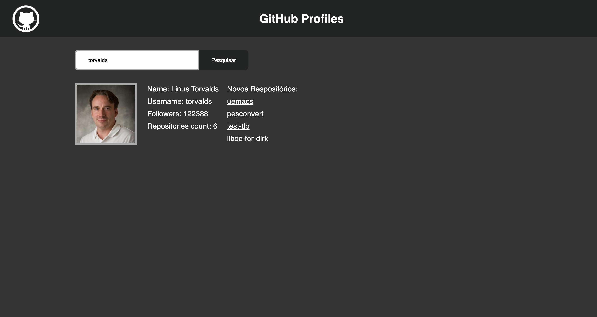

# Descrição

Seu desafio vai ser construir uma página que se comunica diretamente com o GitHub!

Nosso objetivo é criar uma interface que se comunique com o GitHub para procurar e exibir informações de diferentes usuários como nome, número de seguidores e repositórios conforme template abaixo disponível já no
HTML e CSS deste repositório.

# Requisitos

- [ ] Os usuários devem poder entrar com um nome de usuário na caixa de busca.

- [ ] Ao clicar em "Pesquisar", se a conta existir, devem ser exibidas as informações do perfil como:

1. Nome
2. Apelido
3. Número de seguidores
4. Número de repositórios públicos
5. Lista de repositórios recentes.

- [ ] Se a conta não existir, exiba uma mensagem de erro amigável na tela. O formato é livre.

- [ ] Ao pesquisar por um outro usuário, as informações do usuário pesquisado anteriormente devem continuar sendo exibidas. O novo usuário aparece acima na pilha.

- [ ] Para obter os dados, deve ser efetuada busca via API do GitHub, usando a biblioteca AXIOS.

- [ ] A biblioteca deve usar dependência local, disponível por meio do `node_modules`.

- [ ] Use features do ES6 para implementação, como _Arrow Functions_, _Template String_ etc.

# Como começar

Use esse repositório como template clicando no botão "Use this template".

# Onde usar ES6

Tente usar _Template String_, `forEach` e _Arrow Functions_ para criar suas funções de render, caso opte por ir por esse caminho.
O _Template String_ pode facilitar na hora de construir o código HTML customizado para o usuário. O `forEach` vai ajudar na hora de percorrer a lista de usuários. _Arrow Functions_ vão funcionar muito bem com o `forEach`.

Sinta-se livre para usar em qualquer outro lugar que quiser também. 😉

# Como obter os dados a partir da API

O GitHub tem uma vasta API, com diversos recursos disponíveis e descritos em documentação.

Para pegar os dados, serão necessárias duas requisições. Uma para pegar os dados do usuário em `https://api.github.com/users/:username` e documentado em

https://developer.github.com/v3/users/

E outra para `https://api.github.com/users/:username/repos` documentada em

https://developer.github.com/v3/repos/

`:username` é uma variável a ser substituída na requisição pelo apelido do usuário.
